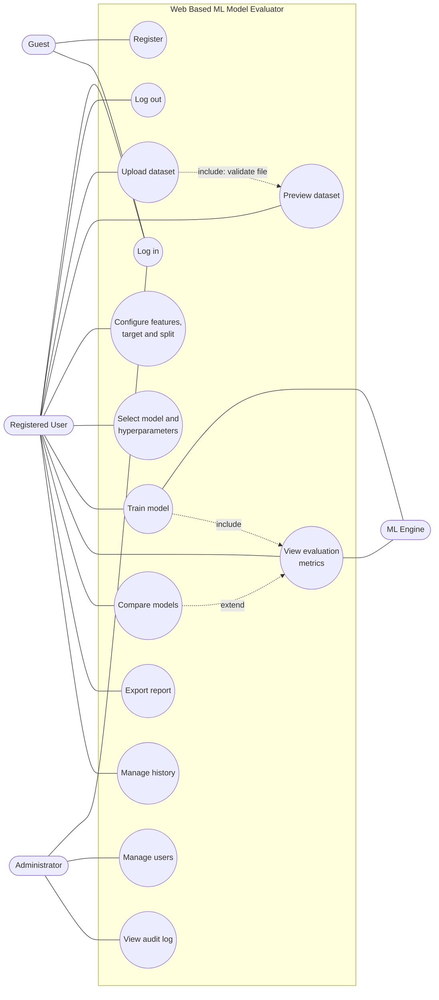

# Software Requirements Specification (SRS)
## Web Based ML Model Evaluator

| **Team** | 
|*[Shreya Shahapur , PES1UG24CS442]* |
|*[Sneha Anil , PES1UG24CS460]* |
|*[Sukhmeet Kaur , PES1UG24CS479]* |
| Software Engineering Mini-Project, Phase1 |

---

## 1. Introduction

### 1.1 Purpose
This document specifies the requirements of the **Web Based ML Model Evaluator (MLME)**, a web application that lets users upload a tabular dataset, choose machine learning models, train and test them, and compare their performance through standard metrics. It is intended for the development team, testers, and course evaluators.

### 1.2 Scope
This will:
- Accept CSV datasets uploaded by authenticated users
- Provide a data pipeline (validation, cleaning, train/test split)
- Provide a model selector with a fixed catalogue of scikit-learn models
- Train and test the selected models and report metrics
- Compare models side by side and export reports

MLME doesn't provide deep learning, distributed training, real-time model serving, or image/text datasets.

### 1.3 Terms and Thier Definations

| Term | Meaning |
|---|---|
| ML | Machine Learning |
| FR / NFR | Functional / Non-Functional Requirement |
| SRS | Software Requirements Specification |
| RBAC | Role-Based Access Control |
| CSV | Comma-Separated Values |
| F1 | Harmonic mean of precision and recall |
| MAE / MSE / R² | Mean Absolute Error / Mean Squared Error / Coefficient of Determination |
| TLS | Transport Layer Security |

---

## 2. Overall Description

### 2.1 Product Perspective
MLME is a standalone client-server web application.

- **Client:** browser-based UI (HTML/CSS/JavaScript)
- **Server:** Python (Django) application exposing a REST API
- **ML Engine:** scikit-learn based module invoked by the server
- **Storage:** relational database (SQLite/PostgreSQL) for users, dataset metadata, and results; file storage for uploaded datasets

### 2.2 Product Functions (summary)
1. User account management
2. Dataset upload, validation and preview
3. Feature/target selection and train-test split configuration
4. Model selection and training
5. Evaluation with metrics and visualisations
6. Multi-model comparison
7. Report export and history
8. Administration and audit logging

### 2.3 User Classes and Characteristics

| User class | Description |
|---|---|
| Guest | Unauthenticated visitor; can only register or log in |
| Registered User | Student/analyst with basic ML knowledge; uploads data and runs evaluations |
| Administrator | Manages users and monitors system activity |

### 2.4 Operating Environment
- Server: Linux/Windows, Python 3.10+, Django 4.x, scikit-learn 1.x
- Client: latest two versions of Chrome, Firefox, or Edge

### 2.5 Design and Implementation Constraints
- Python (Django) technology stack
- Only CSV input format
- Models limited to scikit-learn's classical algorithms
- Must run on a standard laptop (8 GB RAM) for demonstration

### 2.6 Assumptions and Dependencies
- Users have a modern browser and internet/LAN access
- Uploaded datasets are tabular with a header row
- scikit-learn and its dependencies remain available

---

## 3. Specific Requirements

Requirement wording follows the standard "The system shall…" form. Each requirement is intended to be **clear, unambiguous, concise, testable and measurable**. Priority: **H** (High), **M** (Medium), **L** (Low).

### 3.1 Functional Requirements (FRs)

| ID | Requirement | Priority |
|---|---|---|
| **FR-01** | The system shall allow a guest to register using a unique email address and a password of at least 8 characters. | H |
| **FR-02** | The system shall allow a registered user to log in with email and password and to log out, ending the session immediately. | H |
| **FR-03** | The system shall allow an authenticated user to upload a dataset in CSV format of up to 50 MB. | H |
| **FR-04** | The system shall validate each uploaded file (extension, MIME type, size, header row present, at least 2 columns and 20 rows) and reject invalid files with a specific error message. | H |
| **FR-05** | The system shall display a preview of the first 20 rows of an uploaded dataset with the detected data type of each column within 3 seconds of upload completion. | M |
| **FR-06** | The system shall allow the user to select one target column and one or more feature columns from the uploaded dataset. | H |
| **FR-07** | The system shall handle missing values by offering the options "drop rows", "mean/mode imputation" or "none", and shall apply the selected option before training. | M |
| **FR-08** | The system shall allow the user to set the test-set size between 10% and 50% (default 20%) and a random seed for the train-test split. | H |
| **FR-09** | The system shall let the user choose one or more models from a catalogue containing at least: Logistic Regression, Decision Tree, Random Forest, k-Nearest Neighbours, Support Vector Machine (classification) and Linear Regression, Decision Tree Regressor, Random Forest Regressor (regression). | H |
| **FR-10** | The system shall allow the user to edit at least two hyperparameters per selected model, using default values when none are given. | M |
| **FR-11** | The system shall train each selected model on the training split and report training status (queued, running, completed, failed). | H |
| **FR-12** | The system shall evaluate each trained model on the test split and display accuracy, precision, recall, F1-score and a confusion matrix for classification tasks. | H |
| **FR-13** | The system shall display MAE, MSE and R² for regression tasks. | H |
| **FR-14** | The system shall display a side-by-side comparison table and a bar chart of metrics for two or more evaluated models. | M |
| **FR-15** | The system shall allow the user to export an evaluation report as PDF or CSV. | M |
| **FR-16** | The system shall keep a history of a user's evaluations and allow the user to view or delete any of them. | M |
| **FR-17** | The system shall allow an administrator to view, deactivate and delete user accounts. | M |
| **FR-18** | The system shall allow an administrator to view an audit log of logins, uploads and evaluation runs. | L |

### 3.2 Non-Functional Requirements (NFRs)

| ID | Category | Requirement |
|---|---|---|
| **NFR-01** | Performance | The system shall load any page in 3 seconds or less for 95% of requests under normal load (up to 20 concurrent users). |
| **NFR-02** | Performance | The system shall complete training and evaluation of any single catalogue model within 60 seconds for datasets up to 10,000 rows and 20 features. |
| **NFR-03** | Scalability | The system shall support at least 20 concurrent authenticated users without error rates above 1%. |
| **NFR-04** | Usability | A first-time user with basic ML knowledge shall be able to complete an upload-to-evaluation workflow within 5 minutes without external help. |
| **NFR-05** | Compatibility | The system shall render and function correctly on the latest two versions of Chrome, Firefox and Edge. |
| **NFR-06** | Reliability | The system shall be available for at least 99% of the time during scheduled demonstration/testing hours, and a failed training job shall not crash the server. |
| **NFR-07** | Maintainability | The code shall be modular (separate UI, API, ML and data layers) and achieve at least 70% unit-test coverage of the ML and data modules. |
| **NFR-08** | Portability | The system shall be deployable on a fresh machine using documented steps (or a Docker configuration) in 15 minutes or less. |

### 3.3 Security Requirements

#### 3.3.1 Security Objectives

| ID | Objective |
|---|---|
| **SO-1** | **Confidentiality:** Uploaded datasets and evaluation results shall be accessible only to their owner (and administrators for support purposes). |
| **SO-2** | **Integrity:** Datasets, models and reported metrics shall not be altered by unauthorised parties or by malformed input. |
| **SO-3** | **Availability and abuse resistance:** The system shall remain usable under normal load and resist brute-force and resource-exhaustion attempts. |
| **SO-4** | **Accountability:** Security-relevant actions shall be traceable to an identified user. |

#### 3.3.2 Security Requirements

| ID | Requirement | Objective |
|---|---|---|
| **SR-01** | The system shall store passwords only as salted hashes (PBKDF2 or stronger); plaintext passwords shall never be stored or logged. | SO-1 |
| **SR-02** | The system shall enforce role-based access control so that a user can access only their own datasets and results, and only administrators can access admin functions (FR-17, FR-18). | SO-1, SO-2 |
| **SR-03** | The system shall validate uploaded files by extension, MIME type, size (≤ 50 MB) and content structure, and shall never execute or deserialise (e.g. pickle) user-supplied content. | SO-2, SO-3 |
| **SR-04** | The system shall transmit all data over HTTPS (TLS 1.2 or higher) in deployment. | SO-1, SO-2 |
| **SR-05** | The system shall expire idle sessions after 30 minutes and lock an account for 15 minutes after 5 consecutive failed login attempts. | SO-3 |
| **SR-06** | The system shall limit each user to at most 100 API requests per minute and reject excess requests with HTTP 429. | SO-3 |
| **SR-07** | The system shall protect against CSRF, XSS and SQL injection through framework protections and output escaping. | SO-2 |
| **SR-08** | The system shall record login attempts, uploads, evaluation runs and admin actions in an audit log with timestamp and user ID. | SO-4 |

### 3.4 External Interface Requirements

- **User interface:** Responsive web UI with pages for Login/Register, Dashboard, Upload, Configure, Results, Compare, History, and Admin.
- **Software interfaces:** scikit-learn, pandas, NumPy (ML/data); Matplotlib or Chart.js (visualisation); ReportLab or equivalent (PDF export).
- **Communication interfaces:** HTTP(S) REST API with JSON payloads.

---

## 4. Use Case Model

### 4.1 Actors

The system has **4 actors**:

| # | Actor | Type | Description |
|---|---|---|---|
| 1 | **Guest** | Primary | Unauthenticated visitor who can register or log in |
| 2 | **Registered User** | Primary | Uploads datasets, trains and evaluates models, compares and exports results |
| 3 | **Administrator** | Primary | Manages users and reviews audit logs |
| 4 | **ML Engine** | Secondary (system) | scikit-learn module that trains and evaluates models on request |

### 4.2 Use Cases Grouped by Actor

| Actor | Use cases | Related FRs |
|---|---|---|
| Guest | UC-01 Register; UC-02 Log in | FR-01, FR-02 |
| Registered User | UC-03 Log out; UC-04 Upload dataset; UC-05 Preview dataset; UC-06 Configure features/target and split; UC-07 Select model and hyperparameters; UC-08 Train model; UC-09 View evaluation metrics; UC-10 Compare models; UC-11 Export report; UC-12 Manage history | FR-02 to FR-16 |
| Administrator | UC-13 Manage users; UC-14 View audit log | FR-17, FR-18 |
| ML Engine | UC-08 Train model; UC-09 Evaluate model (participates) | FR-11 to FR-13 |

### 4.3 UML Use Case Diagram

> Rendered natively by GitHub (Mermaid). Actors are shown as stadium shapes and use cases as ovals; export to PNG from draw.io/PlantUML if a strict UML notation is required by your evaluator.

---

## 5. Other Requirements

- **Legal/ethical:** Uploaded datasets remain the property of the user; the system shall not share them with other users.
- **Data retention:** Uploaded datasets and results shall be deleted when the user deletes them or the account is removed.

---

## 6. Requirements Traceability Inputs

Full traceability to test cases is maintained in the Test Plan (`2_Test_Plan.md`) and to design components in the Architecture & Design Specification (`3_Architecture_Design_Spec.md`). Requirement IDs used across documents:

- Functional: **FR-01 to FR-18**
- Non-functional: **NFR-01 to NFR-08**
- Security: **SO-1 to SO-4**, **SR-01 to SR-08**

---

## 7. Requirement Categories Summary

| Category | IDs |
|---|---|
| Authentication and accounts | FR-01, FR-02, FR-17, SR-01, SR-02, SR-05 |
| Data pipeline | FR-03 to FR-08, SR-03 |
| Modelling | FR-09 to FR-11 |
| Evaluation and reporting | FR-12 to FR-16 |
| Administration and audit | FR-17, FR-18, SR-08 |
| Quality attributes | NFR-01 to NFR-08 |
| Security | SR-01 to SR-08 |
