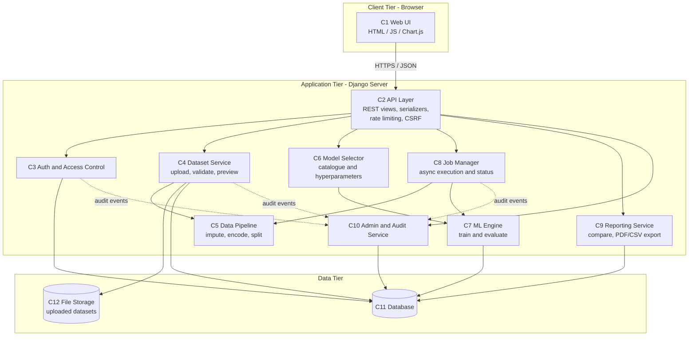
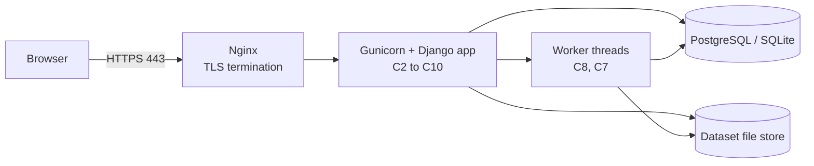
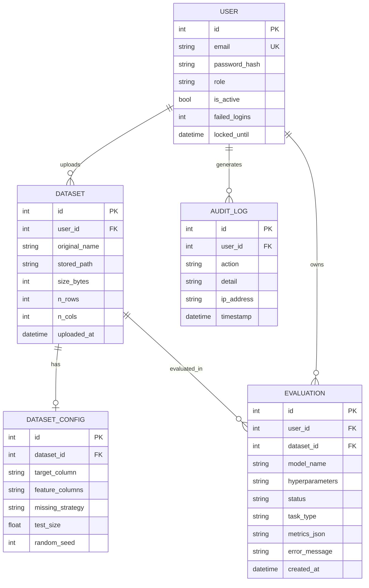
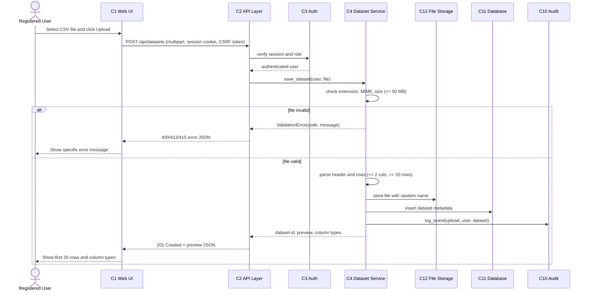
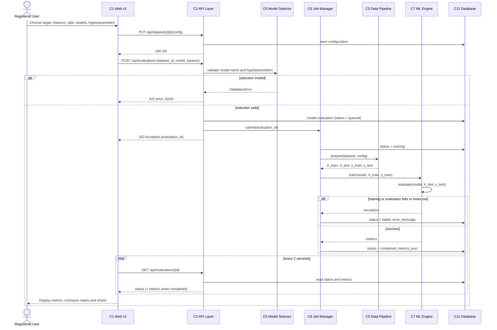
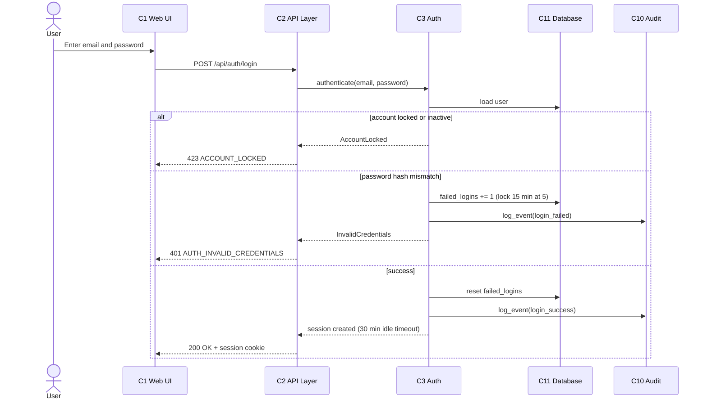

# Software Architecture & Design Specification
## Web Based ML Model Evaluator

| **Team** | 
|*[Shreya Shahapur , PES1UG24CS442]* |
|*[Sneha Anil , PES1UG24CS460]* |
|*[Sukhmeet Kaur , PES1UG24CS479]* |
| Software Engineering Mini-Project, Phase1 |
---

## 1. Introduction

### 1.1 Purpose
This document describes the architecture and detailed design of the **Web Based ML Model Evaluator (MLME)** so that the system can be implemented and tested consistently with the SRS.

### 1.2 Scope
Covers the logical architecture, component decomposition, security architecture, data design, interaction design (sequence diagrams), API design and error handling. Requirement IDs (FR, NFR, SR) refer to the SRS.

### 1.3 Design Goals and Drivers

| Driver | Design response |
|---|---|
| Modularity and maintainability (NFR-07) | Layered architecture with clear component boundaries |
| Responsiveness during training (NFR-01, NFR-02) | Asynchronous job execution; UI polls job status |
| Security (SR-01 to SR-08) | Security controls at every layer (Section 3.4) |
| Portability (NFR-08) | Docker-ready, environment-based configuration |
| Reliability (NFR-06) | Training isolated from web process; failures contained per job |

### 1.4 Technology Choices

| Concern | Choice |
|---|---|
| Language / framework | Python 3.10+, Django 4.x (with Django REST Framework) |
| ML / data | scikit-learn, pandas, NumPy |
| Frontend | Django templates + JavaScript, Chart.js for charts |
| Background jobs | Python worker thread pool (upgradeable to Celery + Redis) |
| Database | SQLite (dev) / PostgreSQL (deployment) |
| Reporting | ReportLab (PDF), Python `csv` |
| Deployment | Gunicorn + Nginx (TLS), Docker |

---

## 2. Architecture

### 2.1 Architectural Pattern

MLME uses a **three-tier layered client-server architecture**, with Django's **MVT (Model-View-Template)** pattern inside the application tier and a **service layer** that keeps business and ML logic independent of the web framework.

| Layer | Responsibility | Components |
|---|---|---|
| Presentation | UI rendering, user interaction | C1 Web UI |
| Application (API + services) | Request handling, business rules, ML processing | C2 to C10 |
| Data | Persistence | C11 Database, C12 File Storage |

**Rationale:** layering isolates change (e.g. swapping the ML library or database), supports independent unit testing (NFR-07), and provides natural places to enforce security (SR-02, SR-03). Long-running work is decoupled through a job manager, which is a light form of the **worker/queue** pattern.

### 2.2 Component Diagram



### 2.3 Component Descriptions

| ID | Component | Responsibilities | Key interfaces |
|---|---|---|---|
| **C1** | Web UI | Pages for login, register, dashboard, upload, configure, results, compare, history and admin; polls job status; renders charts | Calls REST API (C2) over HTTPS |
| **C2** | API Layer | Routes requests, validates payloads, applies authentication, CSRF protection and rate limiting, returns JSON errors in the standard format (Section 5.3) | Uses C3, C4, C6, C8, C9, C10 |
| **C3** | Auth and Access Control | Registration, login/logout, password hashing, session expiry, lockout, role checks (User/Admin), ownership checks | `authenticate()`, `authorize(user, resource)` |
| **C4** | Dataset Service | Receives uploads, validates extension/MIME/size/structure, stores file, produces preview and column types, stores configuration | `save_dataset()`, `preview()`, `save_config()` |
| **C5** | Data Pipeline | Missing-value handling, encoding of categorical features, train/test split with seed | `prepare(dataset, config) -> X_train, X_test, y_train, y_test` |
| **C6** | Model Selector | Model catalogue, allowed hyperparameters and defaults, validates user selections | `list_models()`, `build_model(name, params)` |
| **C7** | ML Engine | Trains model, predicts on test set, computes classification/regression metrics and confusion matrix | `train()`, `evaluate()` |
| **C8** | Job Manager | Queues training jobs, runs them off the request thread, tracks status (queued, running, completed, failed), enforces timeouts, isolates failures | `submit(job)`, `status(job_id)` |
| **C9** | Reporting Service | Builds comparison tables/charts data, generates PDF and CSV reports, provides history | `compare(ids)`, `export(id, format)` |
| **C10** | Admin and Audit Service | User management (view, deactivate, delete), writes and reads audit log | `log_event()`, `list_users()`, `read_log()` |
| **C11** | Database | Users, dataset metadata, configs, evaluations, audit log | ORM (Django models) |
| **C12** | File Storage | Uploaded CSV files stored outside the web root with random file names | Filesystem API |

### 2.4 Traceability to Requirements

| Component | FRs | NFRs | SRs |
|---|---|---|---|
| C1 Web UI | FR-05, FR-06, FR-08, FR-10, FR-12 to FR-14 | NFR-01, NFR-04, NFR-05 | SR-07 (output escaping) |
| C2 API Layer | All (entry point) | NFR-01, NFR-03 | SR-04, SR-06, SR-07 |
| C3 Auth and Access Control | FR-01, FR-02, FR-17 | NFR-06 | SR-01, SR-02, SR-05 |
| C4 Dataset Service | FR-03, FR-04, FR-05, FR-06 | NFR-01 | SR-02, SR-03 |
| C5 Data Pipeline | FR-07, FR-08 | NFR-02 | SR-03 |
| C6 Model Selector | FR-09, FR-10 | NFR-07 | SR-03 (no unsafe deserialisation) |
| C7 ML Engine | FR-11, FR-12, FR-13 | NFR-02, NFR-07 | |
| C8 Job Manager | FR-11 | NFR-02, NFR-03, NFR-06 | SR-06, SR-08 |
| C9 Reporting Service | FR-14, FR-15, FR-16 | NFR-01 | SR-02 |
| C10 Admin and Audit | FR-17, FR-18 | | SR-08 |
| C11 / C12 Data tier | FR-03, FR-16 | NFR-08 | SR-01, SR-02, SR-03 |
| Whole system | | NFR-07, NFR-08 | SR-04 |

### 2.5 Deployment View



### 2.6 Data Design



### 2.7 Security Architecture

**Approach:** defence in depth. Security controls are placed at the network edge, API layer, service layer and data tier, and each maps to SRS security requirements.

| Layer | Control | Requirement |
|---|---|---|
| Network / transport | TLS 1.2+ at Nginx, HTTP redirected to HTTPS, HSTS header | SR-04 |
| API layer (C2) | CSRF tokens, per-user rate limiting (100 requests/min, HTTP 429), request size limits, output escaping, security headers (CSP, X-Content-Type-Options) | SR-06, SR-07 |
| Authentication (C3) | Salted PBKDF2 password hashes, session cookies (`HttpOnly`, `Secure`, `SameSite`), 30-minute idle timeout, lockout after 5 failed logins for 15 minutes | SR-01, SR-05 |
| Authorisation (C3) | Role-based access (User/Admin) and object-level ownership checks on every dataset/evaluation request | SR-02 |
| Input handling (C4, C5) | Extension, MIME, size and structure validation; random stored file names outside web root; CSV cells treated as data (never evaluated); no `pickle` or model file loading from users | SR-03 |
| Execution isolation (C8) | Training runs in worker threads with timeouts and resource limits; failures contained per job | NFR-06, SO-3 |
| Data tier (C11, C12) | ORM parameterised queries (no raw SQL); dataset files readable only by the application user | SR-07, SO-1 |
| Audit (C10) | Login attempts, uploads, evaluation runs and admin actions logged with user ID, timestamp and IP | SR-08 |

**Trust boundaries:** (1) Browser to Nginx (untrusted to trusted), (2) API layer to services (authenticated requests only), (3) services to file storage (validated content only).

**Threat mitigation summary (STRIDE):**

| Threat | Example | Mitigation |
|---|---|---|
| Spoofing | Credential guessing | Hashing, lockout, session timeout (SR-01, SR-05) |
| Tampering | Malicious CSV, forged requests | Upload validation, CSRF tokens (SR-03, SR-07) |
| Repudiation | User denies action | Audit log (SR-08) |
| Information disclosure | Reading another user's dataset | Ownership checks, TLS (SR-02, SR-04) |
| Denial of service | Request flooding, huge files | Rate limits, size limits, job timeouts (SR-03, SR-06) |
| Elevation of privilege | User calls admin API | RBAC checks on every route (SR-02) |

---

## 3. Design

### 3.1 Sequence Diagram SD-1: Upload and Validate Dataset (FR-03, FR-04, FR-05, SR-03)



### 3.2 Sequence Diagram SD-2: Configure, Train and Evaluate Models (FR-06 to FR-13, NFR-02, NFR-06)



### 3.3 Sequence Diagram SD-3: Login with Lockout (FR-02, SR-01, SR-05, SR-08)



### 3.4 Key Design Decisions

| # | Decision | Reason |
|---|---|---|
| D1 | Training is asynchronous (202 + polling) | Avoids request timeouts and keeps UI responsive (NFR-01, NFR-02) |
| D2 | Fixed model catalogue, no user-uploaded models or code | Removes remote-code-execution risk (SR-03) |
| D3 | Service layer separate from Django views | Enables unit tests of ML and data logic without the web layer (NFR-07) |
| D4 | Stored file names randomised, files outside web root | Prevents path traversal and direct download (SO-1, SO-2) |
| D5 | Same random seed reproduces the same split | Reproducible evaluations (FR-08) |

---

## 4. API Design

**Conventions:** base path `/api`, JSON request/response, session authentication with CSRF token on state-changing requests, `Content-Type: application/json` (except upload). All endpoints except register and login require authentication. Timestamps are ISO 8601.

### 4.1 Endpoint Summary

| # | Method | Endpoint | Description | Auth | Req. |
|---|---|---|---|---|---|
| 1 | POST | `/api/auth/register` | Create account | Public | FR-01 |
| 2 | POST | `/api/auth/login` | Log in, start session | Public | FR-02 |
| 3 | POST | `/api/auth/logout` | End session | User | FR-02 |
| 4 | POST | `/api/datasets` | Upload CSV (multipart `file`) | User | FR-03, FR-04 |
| 5 | GET | `/api/datasets` | List own datasets | User | FR-03 |
| 6 | GET | `/api/datasets/{id}/preview` | First 20 rows and column types | Owner | FR-05 |
| 7 | PUT | `/api/datasets/{id}/config` | Save target, features, missing strategy, split | Owner | FR-06, FR-07, FR-08 |
| 8 | DELETE | `/api/datasets/{id}` | Delete dataset | Owner | FR-16 |
| 9 | GET | `/api/models` | Model catalogue with hyperparameters | User | FR-09, FR-10 |
| 10 | POST | `/api/evaluations` | Start training and evaluation | Owner | FR-09 to FR-11 |
| 11 | GET | `/api/evaluations` | List own evaluations (history) | User | FR-16 |
| 12 | GET | `/api/evaluations/{id}` | Status and metrics | Owner | FR-11 to FR-13 |
| 13 | DELETE | `/api/evaluations/{id}` | Delete evaluation | Owner | FR-16 |
| 14 | GET | `/api/evaluations/compare?ids=1,2` | Comparison data | Owner | FR-14 |
| 15 | GET | `/api/evaluations/{id}/report?format=pdf\|csv` | Download report | Owner | FR-15 |
| 16 | GET | `/api/admin/users` | List users | Admin | FR-17 |
| 17 | PATCH | `/api/admin/users/{id}` | Activate/deactivate user | Admin | FR-17 |
| 18 | DELETE | `/api/admin/users/{id}` | Delete user | Admin | FR-17 |
| 19 | GET | `/api/admin/audit-log` | View audit log (filter by user/date) | Admin | FR-18, SR-08 |

### 4.2 Example Request and Response Contracts

**POST `/api/auth/register`**

```json
// Request
{ "email": "user1@test.com", "password": "Str0ngPass!" }

// 201 Created
{ "id": 12, "email": "user1@test.com", "role": "user" }
```

**POST `/api/datasets`** (multipart form, field `file`)

```json
// 201 Created
{
  "id": 7,
  "name": "iris.csv",
  "rows": 150,
  "columns": [
    { "name": "sepal_length", "type": "numeric" },
    { "name": "species", "type": "categorical" }
  ],
  "preview": [ { "sepal_length": 5.1, "species": "setosa" } ]
}
```

**PUT `/api/datasets/7/config`**

```json
// Request
{
  "target": "species",
  "features": ["sepal_length", "sepal_width", "petal_length", "petal_width"],
  "missing_strategy": "mean",
  "test_size": 0.25,
  "random_seed": 42
}
// 200 OK
{ "dataset_id": 7, "saved": true }
```

**POST `/api/evaluations`**

```json
// Request
{
  "dataset_id": 7,
  "model": "random_forest",
  "hyperparameters": { "n_estimators": 50, "max_depth": 5 }
}
// 202 Accepted
{ "evaluation_id": 31, "status": "queued" }
```

**GET `/api/evaluations/31`** (completed classification)

```json
{
  "id": 31,
  "status": "completed",
  "task_type": "classification",
  "model": "random_forest",
  "metrics": {
    "accuracy": 0.95, "precision": 0.95, "recall": 0.95, "f1": 0.95,
    "confusion_matrix": [[13,0,0],[0,12,1],[0,1,11]]
  }
}
```

For regression, `metrics` contains `mae`, `mse` and `r2`. While running, `status` is `queued` or `running` and `metrics` is `null`.

---

## 5. Error Handling

### 5.1 Strategy
1. **Validate early** at the API layer (schema, ranges) and again in services (business rules).
2. **Fail safely:** never expose stack traces, file paths or SQL to users; log details server-side.
3. **Contain failures:** an exception inside a training job marks only that evaluation as `failed`; the server and other jobs continue (NFR-06).
4. **Consistent format:** every error uses the JSON structure in Section 5.2.
5. **Log and audit:** unexpected errors are logged with a correlation ID; security-relevant errors also go to the audit log (SR-08).

### 5.2 Error Response Format

```json
{
  "error": {
    "code": "FILE_TOO_LARGE",
    "message": "The uploaded file exceeds the 50 MB limit.",
    "details": { "max_size_mb": 50 },
    "request_id": "b3f1c2e0"
  }
}
```

### 5.3 Error Codes

| HTTP | Code | Condition | User-facing behaviour |
|---|---|---|---|
| 400 | `VALIDATION_ERROR` | Missing/invalid field, out-of-range split (not 10-50%), unknown column, too few rows/columns | Field-level message shown next to input |
| 400 | `EMAIL_ALREADY_EXISTS` / `WEAK_PASSWORD` | Registration rules violated | Clear registration error |
| 401 | `AUTH_INVALID_CREDENTIALS` | Wrong email or password | Generic "invalid email or password" (no user enumeration) |
| 401 | `SESSION_EXPIRED` | Idle timeout (30 min) | Redirect to login |
| 403 | `FORBIDDEN` | Role or CSRF check failed | "You do not have access" |
| 404 | `NOT_FOUND` | Resource missing or not owned by user | Same response for both cases (avoids leaking existence) |
| 413 | `FILE_TOO_LARGE` | Upload over 50 MB | Message with limit |
| 415 | `UNSUPPORTED_FILE` | Not a valid CSV (extension/MIME/content) | Message asking for CSV |
| 422 | `INVALID_MODEL_CONFIG` | Unknown model or unsupported hyperparameter/value | Show allowed options |
| 423 | `ACCOUNT_LOCKED` | 5 failed logins (15-minute lock) or deactivated account | Message with retry time |
| 429 | `RATE_LIMITED` | More than 100 requests/min | "Slow down" message with `Retry-After` header |
| 500 | `INTERNAL_ERROR` | Unexpected server error | Generic message plus request ID |
| n/a | `TRAINING_FAILED` | Exception or timeout during a job (reported as evaluation `status = failed`) | Failure message, e.g. "Feature column 'x' is non-numeric; choose encoding or remove it" |

### 5.4 Component-Level Handling

| Component | Failure | Handling |
|---|---|---|
| C4 Dataset Service | Corrupt CSV, encoding error, oversized file | Reject, delete partial file, return 400/413/415 |
| C5 Data Pipeline | Non-numeric features, all-missing column, too few samples per class | Raise `DataPreparationError` with actionable message; job marked failed |
| C7 ML Engine | Convergence warning, memory error, timeout (60 s target, hard limit 120 s) | Catch, stop job, store `error_message`, free resources |
| C8 Job Manager | Worker crash | Mark job failed on restart; user can resubmit |
| C9 Reporting | PDF generation error | Return 500 `INTERNAL_ERROR`; CSV export remains available |
| C11 Database | Connection failure | Retry once, then 500; no partial writes (transactions used) |

---

## 6. Requirements Coverage Summary

| Requirement group | Addressed in |
|---|---|
| FR-01, FR-02 | C3, SD-3, API 1-3 |
| FR-03 to FR-08 | C4, C5, SD-1, SD-2, API 4-8 |
| FR-09 to FR-13 | C6, C7, C8, SD-2, API 9-12 |
| FR-14 to FR-16 | C9, API 11, 13-15 |
| FR-17, FR-18 | C10, API 16-19 |
| NFR-01 to NFR-08 | Sections 1.3, 2.1, 2.5, 3.4 |
| SR-01 to SR-08 | Section 2.7, SD-1, SD-3, Section 5 |
